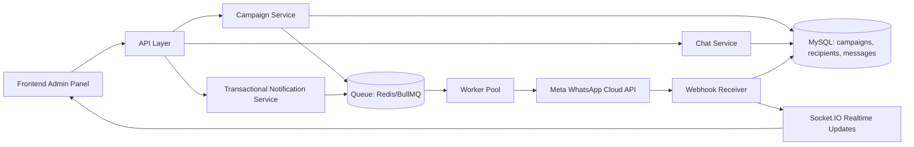
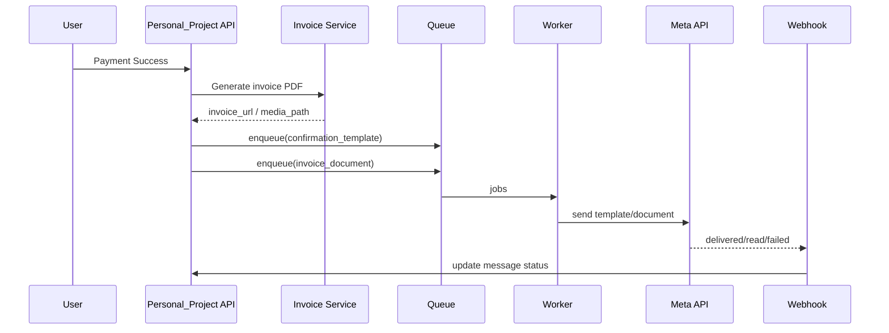
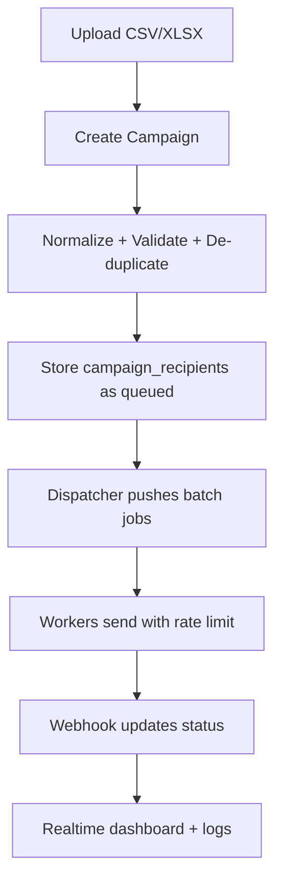

# WhatsApp Integration Approach (Personal_Project)

## 1) Goal
Build a production-ready WhatsApp system for:
1. Booking/order confirmation + invoice delivery.
2. Pooja completion video-link delivery.
3. Bulk template campaigns (1,000 to 100,000 recipients).
4. Admin chat inbox UI (Cloud API number, not phone app).
5. Chatbot integration later (planned as Phase 5).

This document explains what we will build, how we will build it, and in which order.

## 2) Final Scope (Phase-wise)
- Phase 1: Transactional WhatsApp notifications (order/booking/invoice).
- Phase 2: Pooja-completed video-link messaging.
- Phase 3: Bulk campaigns with strong queue architecture.
- Phase 4: Admin chat inbox UI + realtime status updates.
- Phase 5: Chatbot integration (to be designed from your flow later).

## 3) High-Level Architecture



## 4) Core Flows

### 4.1 Booking/Order Confirmation + Invoice


### 4.2 Pooja Completed Video Link
1. Admin marks booking status as `completed`.
2. System stores `video_url` (or media id).
3. System enqueues template message with video CTA/link.
4. Webhook updates delivery/read status.

### 4.3 Bulk Campaign


### 4.4 Admin Chat Inbox
1. Inbound WhatsApp message arrives on webhook.
2. Save message in `whatsapp_messages` as `inbound`.
3. Socket event updates chat UI immediately.
4. Admin replies from panel.
5. If outside customer window, enforce template reply.

## 5) Data Model (Recommended)

### 5.1 whatsapp_contacts
- id
- user_id (nullable)
- phone_e164 (unique)
- name
- opt_in_status
- opt_in_source
- opt_in_at
- opt_out_at
- last_inbound_at
- notes

### 5.2 whatsapp_campaigns
- id
- name
- template_id
- status (draft/scheduled/processing/completed/partial/failed/cancelled)
- scheduled_at
- total_recipients
- sent_count
- delivered_count
- read_count
- failed_count
- created_by
- created_at

### 5.3 whatsapp_campaign_recipients
- id
- campaign_id
- contact_id
- recipient_phone
- payload_json (variable mapping snapshot)
- status (queued/sent/delivered/read/failed/skipped)
- error_code
- error_message
- attempts
- next_retry_at
- wamid
- created_at
- updated_at

### 5.4 whatsapp_messages
- id
- wamid (unique)
- direction (outbound/inbound)
- message_type (template/text/document/image/video)
- phone
- template_name
- content
- media_url
- campaign_id (nullable)
- order_id (nullable)
- booking_id (nullable)
- status
- sent_at
- delivered_at
- read_at
- failed_at
- error_log

### 5.5 whatsapp_events (optional but useful)
- id
- event_type
- event_key (unique for idempotency)
- payload_json
- processed_at

## 6) API Design (Suggested)

### 6.1 Webhook
- `GET /webhook` verify token
- `POST /webhook` process statuses + inbound messages

### 6.2 Transactional
- internal event trigger: `ORDER_PAID`, `BOOKING_COMPLETED`
- service methods:
  - `sendOrderConfirmation(orderId)`
  - `sendInvoice(orderId)`
  - `sendPoojaVideo(bookingId, videoUrl)`

### 6.3 Campaigns
- `POST /api/admin/whatsapp/campaigns`
- `GET /api/admin/whatsapp/campaigns`
- `GET /api/admin/whatsapp/campaigns/:id`
- `POST /api/admin/whatsapp/campaigns/:id/cancel`

### 6.4 Chat
- `GET /api/admin/whatsapp/chat/conversations`
- `GET /api/admin/whatsapp/chat/messages/:phone`
- `POST /api/admin/whatsapp/chat/send`
- `PUT /api/admin/whatsapp/chat/read/:phone`

### 6.5 Template APIs (Phase-1 implemented)
- `POST /api/whatsapp/admin/templates`
  - Create template from admin payload and submit to Meta.
- `GET /api/whatsapp/admin/templates`
  - List local template registry with Meta status, active flag, mapped use-cases.
- `POST /api/whatsapp/admin/templates/sync`
  - Pull template statuses from Meta and sync local DB.
- `PATCH /api/whatsapp/admin/templates/:id/toggle-active`
  - Activate/deactivate local template.
- `DELETE /api/whatsapp/admin/templates/:id`
  - Delete local template (optional Meta delete via query flag).
- `GET /api/whatsapp/admin/template-usecases`
  - Get available use-cases + current mappings.
- `PUT /api/whatsapp/admin/template-usecases/:useCase`
  - Assign approved template and variable mapping to event use-case.

### 6.6 Admin UI (Phase-1 implemented)
- Admin page path: `/admin/whatsapp/templates`
- Features:
  - create UTILITY/MARKETING template
  - sync template approvals from Meta
  - manage active/inactive state
  - map templates to `order_confirmed` and `pooja_completed`
  - variable mapping and preview before saving

## 7) Scale Strategy (1k to 100k)

### 7.1 Queue and Workers
- Use Redis + BullMQ.
- Use separate worker process (not same API thread).
- Horizontal worker scaling supported.

### 7.2 Throughput Control
- Token bucket/rate limiter per phone number id.
- Dynamic concurrency by error rate and webhook health.
- Controlled retries with exponential backoff.

### 7.3 Reliability
- Idempotency key: `(campaign_id + recipient_phone + template_version)`.
- Dead-letter queue for permanent failures.
- Resume-safe processing on restarts.

### 7.4 DB Performance
- Batch inserts for recipients.
- Indexes on `campaign_id`, `status`, `next_retry_at`, `wamid`, `phone`.
- Read model endpoints for dashboard totals.

## 8) Security and Compliance
- Keep Meta access token only on backend `.env`.
- Verify webhook signature (`X-Hub-Signature-256`) using app secret.
- Enforce opt-in and opt-out list.
- Audit logging for sends and failures.
- Role-protect admin campaign/chat endpoints.

## 9) Reuse Plan from Bulkweb
We can reuse concept/modules from your `E:/Bulkweb/Bulkweb` project:
- Campaign and log concepts.
- Template sync pattern.
- Webhook status processing idea.
- Chat UI building blocks.

We should NOT copy directly without hardening:
- In-process sequential sending loops.
- Unprotected chat routes.
- Hardcoded pricing assumptions.
- Missing webhook signature validation.

## 10) Implementation Plan for Personal_Project

### Step 1 (Transactional foundation)
1. Add WhatsApp service module in server.
2. Add webhook route + status processor.
3. Trigger confirmation + invoice send after payment success.

### Step 2 (Pooja completed video)
1. Add `video_url` field for booking or completion record.
2. Trigger template send on booking completion.

### Step 3 (Bulk architecture)
1. Add campaign tables and recipient queue model.
2. Add BullMQ + Redis worker process.
3. Add campaign create/list/cancel APIs.
4. Add dashboard metrics.

### Step 4 (Chat inbox)
1. Add conversation APIs and admin UI page.
2. Realtime updates via existing Socket.IO.
3. Read/unread and notes support.

### Step 5 (Chatbot)
1. Integrate bot router after you share chatbot flow.
2. Add handoff between bot and human inbox.

## 11) Pending Inputs From You
1. Final template list (names + language + variables).
2. Pooja completion trigger source (manual by admin or automatic workflow).
3. Bulk campaign policy (allowed hours, frequency cap, audience rules).
4. Chatbot flow (you said you will provide later).

## 12) Definition of Done
- Transactional sends working with statuses.
- Video-link send on pooja completion working.
- Bulk campaign stable and resumable for 100k.
- Admin chat UI operational with realtime updates.
- Security checks and logs in place.

## 13) Current Build Status (as of 2026-03-08)

### Implemented in code (Phase 1 foundation)
- DB tables added:
  - `whatsapp_contacts`
  - `whatsapp_messages`
  - `whatsapp_jobs`
- Queue worker added in backend startup (`server/server.js`).
- Payment success now enqueues:
  - order confirmation template job
  - invoice document job
- Webhook endpoints added:
  - `GET /api/whatsapp/webhook` (verification)
  - `POST /api/whatsapp/webhook` (status + inbound processing)
- Status tracking implemented:
  - `sent`, `delivered`, `read`, `failed`
- Failed-number tracking implemented:
  - retries + `last_error` in `whatsapp_jobs`
  - permanent failures marked in `whatsapp_messages`
- Realtime updates wired to Socket.IO events:
  - `whatsapp_job_sent`
  - `whatsapp_status_update`
  - `whatsapp_inbound_message`
- Hardcoded template body creation removed from code.
- Order confirmation now prefers use-case mapping (`order_confirmed`) and falls back to env if mapping is missing.

### Designed but not yet fully wired in business flow
- Pooja completed video template queue function exists; trigger integration to booking completion flow is pending.
- Bulk campaign management APIs + UI are pending.
- Admin chat conversation APIs + UI are pending.
- Webhook signature verification (`X-Hub-Signature-256`) is implemented.
  - It is enforced when `WHATSAPP_APP_SECRET` (or `META_APP_SECRET`) is set.

## 14) Example Flows (Concrete)

### 14.1 Example A: Order Confirmation + Invoice (automated)
1. User pays order successfully.
2. `verifyPayment` marks order paid and generates invoice.
3. System enqueues 1-2 jobs in `whatsapp_jobs`:
   - `order_confirmation_template`
   - `invoice_document` (if public invoice URL is available)
4. Worker picks jobs, sends via Meta API, writes `wamid` in `whatsapp_messages`.
5. Meta webhook sends status callbacks (`delivered/read/failed`).
6. Webhook updates DB and emits realtime socket event for admin dashboard.

Sample queue payloads:
```json
{
  "job_type": "order_confirmation_template",
  "phone": "9198XXXXXXXX",
  "payload": {
    "templateName": "order_confirm_v1",
    "languageCode": "en_US",
    "customerName": "Arjun",
    "orderNumber": "ORD-10231"
  }
}
```

```json
{
  "job_type": "invoice_document",
  "phone": "9198XXXXXXXX",
  "payload": {
    "documentUrl": "https://api.example.com/uploads/invoices/invoice_ORD-10231.pdf",
    "fileName": "invoice_ORD-10231.pdf",
    "caption": "Invoice for order ORD-10231"
  }
}
```

### 14.2 Example B: Pooja Completed + Video Link
1. Admin completes booking and saves `video_url`.
2. System calls `queuePoojaVideoNotification(...)`.
3. Worker sends approved template containing video link.
4. Read/failure tracked through webhook like transactional flow.

Sample template parameters:
```json
{
  "templateName": "pooja_completed_v1",
  "languageCode": "en_US",
  "customerName": "Arjun",
  "videoUrl": "https://cdn.example.com/pooja/booking-445.mp4"
}
```

### 14.3 Example C: Bulk Campaign (next phase)
1. Admin uploads CSV (for example 50,000 contacts).
2. System validates numbers, deduplicates, and stores recipient rows.
3. Dispatcher creates batched queue jobs (for example chunks of 500-2000).
4. Worker pool sends with rate limiting and retry policy.
5. Dashboard updates in near-real-time:
   - queued
   - sent
   - delivered
   - read
   - failed

## 15) Automation Clarification for Client
- Yes, correct approach is:
  1. Build reliable messaging infrastructure first.
  2. Attach business events (payment success, booking completion, campaign schedule).
  3. Then enable full automation with retries, monitoring, and controls.
- This prevents message loss and makes scale (1k to 100k) safe.


